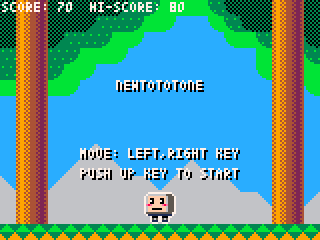
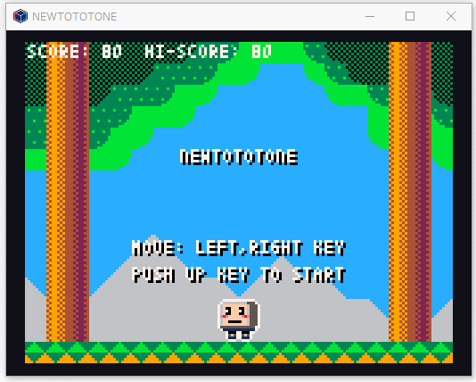

newtototone_pyxel
=================

NEWTOTOTONE (Pyxel version) - Simple 2D game.

Description
-----------

 Example of a game using [Pyxel](https://github.com/kitao/pyxel) .

Pyxel is a retro game engine for Python.

Screenshot
----------

Requirement
-----------

* Python 3
* Pyxel

Install
-------

1. Install [Python 3.x](https://www.python.org/) and [Pyxel](https://github.com/kitao/pyxel) . (pip install pyxel)
2. Clone and copy this repository
3. python newtototone.py

Usage
-----

* Player move : Left or Right key.
* Game start : Up key.

Let's catch the apples !

Licence
-------

CC0 / Public Domain

Author
------

[mieki256](https://github.com/mieki256)
